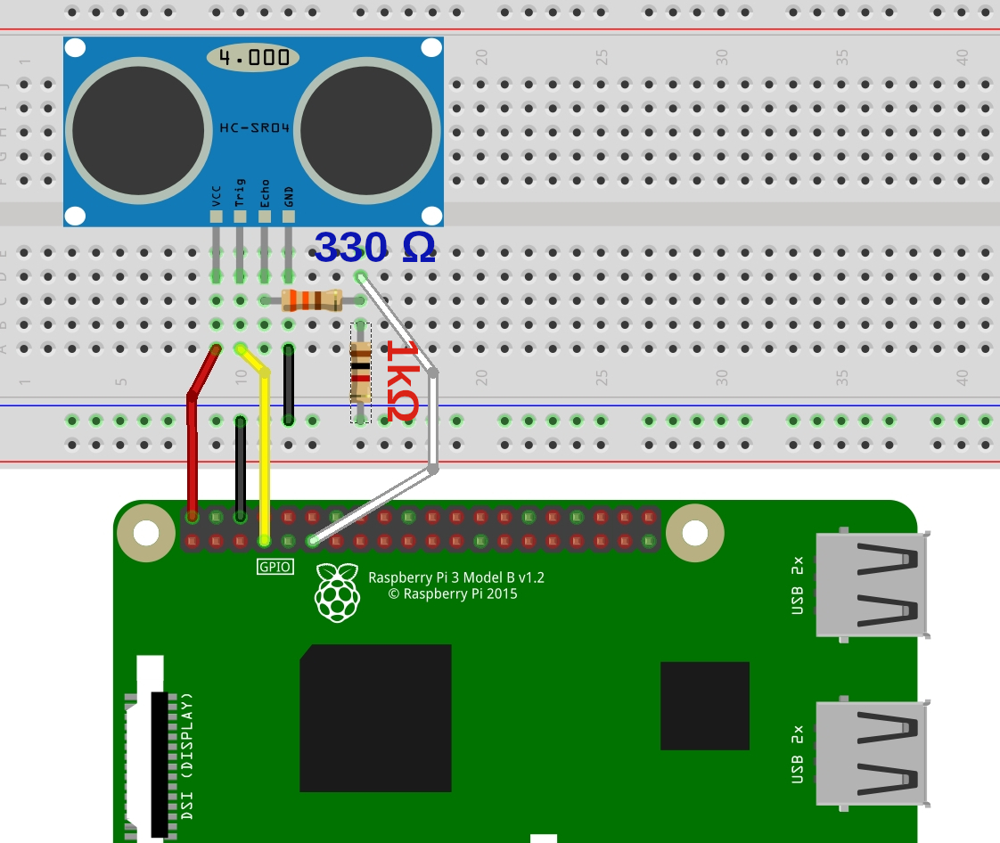

## RPi distance activated sound files
The included code uses an HC-SR04 ultrasonic sensor. Short sound clips are activated and played in loop depending on predefined distance paremeters. <br/>
Sound files are to be prepared as .wav 16-bit. 3 files are provided in this repository, for testing. <br/>
A small bug remains in the included file. When sensor is approached somewhere under 5cm the code freezes. Didn't take time yet to fix this. Everything works fine otherwise.<br/>
<br/>
Installation of module pygame for python3 is required:
```bash
sudo apt-get update
sudo apt-get install python3-pygame
```

### Hookup guide:
The ultrasonic sensor requires 5v to function correctly. Resistors are used to manage the 5 volt signal echoed from the ultrasonic sensor. This protects the Raspberry Pi, wanting no more than a 3.3V signal. Otherwise danger!



